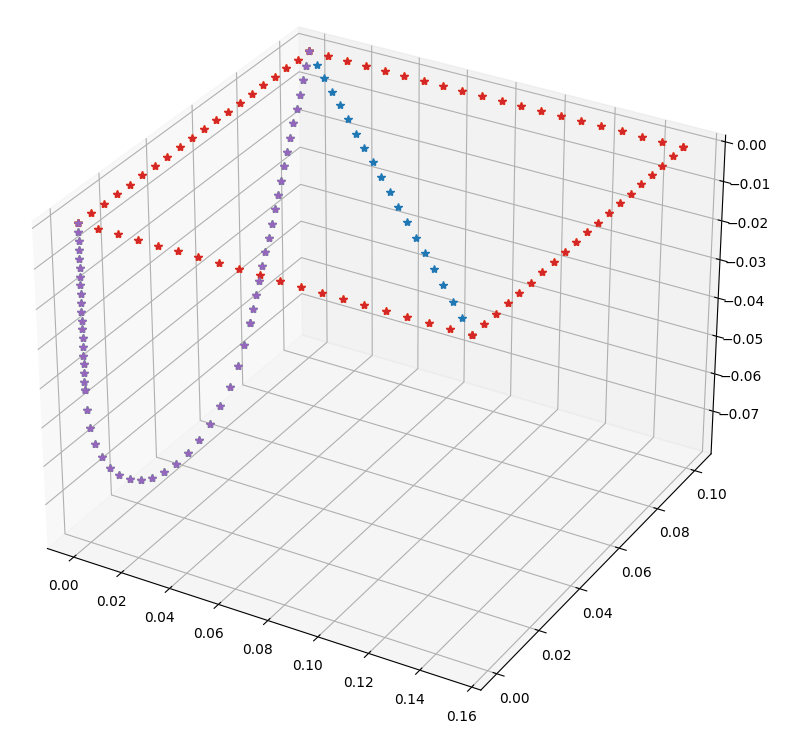

Python library for reading CAD files in the legacy IGES file format.

https://shocksolution.com/cadcam/iges-file-reader/

IGES Format Reference: https://shocksolution.files.wordpress.com/2017/12/iges5-3_fordownload.pdf

More digestible reference:
https://wiki.eclipse.org/IGES_file_Specification

# Goals & Motivations
[I'm](hughes.thad@gmail.com) interested in using this to load wireframes. I don't care about surfaces or solids (yet). But I do want to use IGES CAD data to make beam FE models. This means I'm ultimately going to be collapsing things down into segments, so that will be the endgame for me (.linspace and .arange methods for each entity type which return matrices of x/y/z data).

It's working so far.

Order of priority for reading entities:
- Lines
- Arcs
- Composite curves
- Conic arcs
- Rational B-spline curves

I may also want the ability to 'split' entities at connecting points... but that does seem like it'd fall into the realm of post-processing and is outside this module's scope.

Now, why IGES? Because it's the only file format that most CAD packages won't complain about saving wireframes to.

Why not pythonocc? I spent 20 hours trying to figure out how to actually extract information from a CAD file. There are no examples on the internet of how to do this. I'm confused and think I'm wrong too. But this way, the SLOC is lower, no?